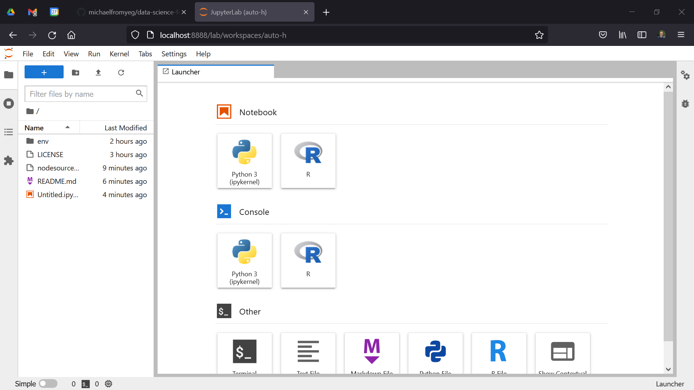

# Data Science for People in a Hurry (Intro to Data Science with R)

Your one-stop shop for an introduction to data science, using the R programming language.

<p align="center">
  
</p>

## About 🤔

This workshop is a 1.5-hour guide to data science using R. It is going to be first run at Hack The North 2021!

## Getting Started 🏃‍♂️

Here's how to contribute to this guide.

### Prerequisites 📝

* [Python](https://www.python.org/) v3.x
* [Node.js](https://nodejs.org/en/) v12.x (or greater)

If you're using Homebrew (or Linuxbrew), try

```shellscript
brew install node python
```

If you need to install Node via the Ubuntu package manager, you can run `bin/nodesource_setup.sh` to ensure Node 16 is install (and not Node 10).

### Installation ⤵️

Setup a virtual environment.

```shellscript
python -m venv env
source env/bin/activate
```

Install [Jupyter Lab](https://jupyterlab.readthedocs.io/en/stable/getting_started/installation.html).

```shellscript
pip install jupyterlab
```

Then install [R](https://rtask.thinkr.fr/installation-of-r-4-0-on-ubuntu-20-04-lts-and-tips-for-spatial-packages/). The following steps are required for R 4.x on Ubuntu 20.04.

```shellscript
$ sudo apt install dirmngr gnupg apt-transport-https ca-certificates software-properties-common
$ sudo add-apt-repository 'deb https://cloud.r-project.org/bin/linux/ubuntu focal-cran40/'
$ sudo apt install r-base
$ R --version
> R version 4.1.1 (2021-08-10) -- "Kick Things"
> ...
```

You'll also need [IRKernel](https://github.com/IRkernel/IRkernel).

```shellscript
# From the shell
$ R
> (...from within the R terminal)
> install.packages('IRkernel')
> IRkernel::installspec(user = FALSE)  # to register the kernel in the current R installation
> q()

# Back in the shell
$ jupyter labextension install @techrah/text-shortcuts  # for RStudio's shortcuts
> Building jupyterlab assets (production, minimized)

# And you're done!
```

Begin Jupyter.

```shellscript
jupyter lab
```

If it worked, you should have a screen that looks a bit like the follow image.

<p align="center">
  
</p>

As a backup (or in case you run into any issues and don't want to create a ticket), you can also spin up the Docker image.

```shellscript
docker run -d -p 8888:8888 jupyter/r-notebook
```

## Presenting

TODO: follow [this](https://medium.com/@mjspeck/presenting-code-using-jupyter-notebook-slides-a8a3c3b59d67) guide.

## Authors 🧑‍💻

* [Michael DeMarco](https://github.com/michaelfromyeg)

## Contributing 🆘

Contributions are welcome! Feel free to either create a ticket or open a pull request.
